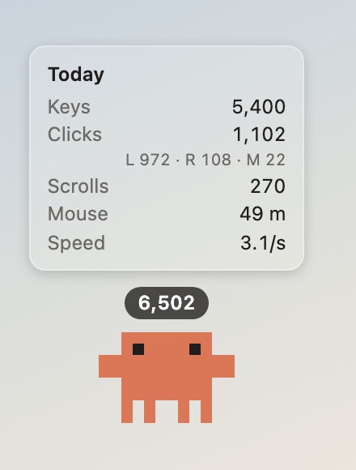

# Jokbet

**English** · [简体中文](README.zh-CN.md)

[](https://github.com/sparkjokerben/jokbet/actions/workflows/ci.yml)
[](LICENSE)
[](https://github.com/sparkjokerben/jokbet/releases/latest)

Jokbet is a desktop pet that counts your keyboard and mouse activity. It sits in
a corner of the screen in the pixel style of Claude Code's mascot, reacts while
you type and click, and keeps a per-day tally of what you did — never of what
you typed.



It runs on macOS 11+, Windows, and Linux (X11). The interface is in English and
Simplified Chinese: it follows the system language unless you pick one in the
settings.

## Features

- Counts key presses per key, left/right/middle clicks, scroll gestures, and
  mouse travel in metres, stored per day
- A number above its head: today's total or the live per-second rate, from the
  keyboard, the mouse, or both added together
- Hover it for today's figures; right-click it, or use the tray icon, for the menu
- It types along on a laptop while you work, flinches when you click, follows
  your cursor with its eyes, falls asleep when you are away, and can be dragged
  anywhere on screen
- Idle behaviour and click reactions are yours to choose: juggle a ball, look
  around, wave, blush, or simply breathe
- It steps aside while another app is full screen or presenting, and comes back
  after (a setting, on by default)
- Global shortcuts to show or hide it and to pause counting, which you record
  in the settings; none is set until you do
- A stats window with a per-day trend, a keyboard heatmap drawn on the layout
  you have (a PC or an Apple board, ANSI or ISO), and CSV export
- Milestones: it celebrates your thousandth key of the day, your millionth key
  all time, and any threshold you set yourself

## Install

Every installer is on the [download page](https://jokbet.jokerben.top/download)
and on [Releases](https://github.com/sparkjokerben/jokbet/releases). The builds
are not notarized or signed by a trusted authority, so your system warns you the
first time; the steps below get past that.

### macOS

```sh
curl -fsSL https://jokbet.jokerben.top/install.sh | sh
```

That downloads the newest release for your Mac, checks it against the published
SHA-256, installs it in `/Applications`, and opens it. Run it again to update.
Reading [`site/install.sh`](site/install.sh) first is encouraged: it is a short
script, and it is the same one that address serves.

To install by hand instead, open the `.zip` and move `Jokbet.app` to
Applications: `aarch64` for Apple Silicon, `x64` for Intel. Then open it once,
and when macOS says it cannot verify the developer, go to **System Settings →
Privacy & Security** and click **Open Anyway** (on macOS 15 and later,
right-click → Open no longer works). Allow **Input Monitoring** when asked
(**System Settings → Privacy & Security → Input Monitoring**): without it the
pet shows a confused face and counts nothing.

A `.dmg` downloaded in a browser is stopped twice, once when the disk image is
opened and once for the app inside it, which is why the `.zip` is the shorter
path. If counting ever
stops after an update, remove the old entry from Input Monitoring and add the
app again.

### Windows

Run the `.exe` or the `.msi`. If SmartScreen says "Windows protected your PC",
click **More info → Run anyway**. Some antivirus tools flag any program that
listens to the keyboard; this one only counts presses.

### Linux (X11)

Use the AppImage, which updates itself, or the `.deb`. Only X11 sessions are
supported — Wayland does not let an application observe global input. The
transparent window needs a compositor, and the tray menu needs an
AppIndicator-compatible host.

## Privacy

Jokbet stores counts and nothing else:

- how many times each key was pressed — no characters, no words, no order
- how many clicks, by button
- how many scroll gestures, and how far the mouse moved

There is no telemetry and no account, and no network request other than the
update check. Everything goes into a local SQLite file, and the app works
offline. The website at `jokbet.jokerben.top` counts visits with Cloudflare Web
Analytics, which sets no cookies and does not identify anyone.

## Your data

`stats.sqlite` holds the counts, and `settings.json` holds your settings.

| Platform | Counts | Settings |
|---|---|---|
| macOS | `~/Library/Application Support/io.github.sparkjokerben.jokbet/` | same directory |
| Windows | `%APPDATA%\io.github.sparkjokerben.jokbet\` | same directory |
| Linux | `~/.local/share/io.github.sparkjokerben.jokbet/` | `~/.config/io.github.sparkjokerben.jokbet/` |

Deleting both files resets Jokbet to a first run. An install upgrading from the
project's former name `jokerben-desktop-pet` brings them across on first launch.
If `settings.json` is damaged, Jokbet keeps every setting it can still read and
sets the original aside as `settings.bad-<time>.json`.

Jokbet also writes a log, `Jokbet.log`, rotated at 1 MB. It records errors and
the version that wrote them, never input. **Settings → About → Open Logs
Folder** opens it, which is the file to attach to a bug report.

| Platform | Log |
|---|---|
| macOS | `~/Library/Logs/io.github.sparkjokerben.jokbet/` |
| Windows | `%LOCALAPPDATA%\io.github.sparkjokerben.jokbet\logs\` |
| Linux | `~/.local/share/io.github.sparkjokerben.jokbet/logs/` |

## Known limitations

- **macOS** — keys typed while **Secure Keyboard Entry** is on (in a password
  field, or when enabled in Terminal or iTerm) are hidden from every other
  application, so they are not counted. Clicks, mouse movement, and the modifier
  keys still are.
- **Windows** — input going to a window running as administrator is not seen
  unless Jokbet also runs as administrator, and the pet stays on the virtual
  desktop it was started on.
- **Linux** — X11 only.
- It stays above other windows. It steps aside for full-screen apps and
  presentations unless that setting is off; anything else it covers, hide it
  from the tray menu or with a shortcut, or move it back to its corner from the
  menu.

## Development

Node 24+ and a stable Rust toolchain are required.

```sh
npm install
npm run tauri dev        # run the app
npm test                 # frontend tests
npm run check            # type check
cd src-tauri && cargo test
```

Other commands worth knowing:

```sh
npm run sprites          # render every animation frame to sprites.png
node scripts/render-sprites.ts anim soccer out.png 8 4   # one animation, larger
npm run icons            # regenerate the app and tray icons from the sprite
npm run site:check       # fail if the website's generated files have drifted
```

With `npm run dev` running, `http://localhost:1420/preview.html?view=stats`
(`settings`, `onboarding`, `pet`) renders a window in a normal browser against
fake data, which is handy for layout work without the Tauri shell. `npm run dev`
is also the server `tauri dev` drives for hot reload.

On macOS, `tauri dev` runs the app as a child of your terminal, so grant Input
Monitoring to the terminal itself. To exercise the real permission flow, build a
bundle with `npm run tauri build -- --debug --bundles app`. Every rebuild
changes the ad-hoc signature, so clear the stale grant with:

```sh
tccutil reset ListenEvent io.github.sparkjokerben.jokbet
```

[`CONTRIBUTING.md`](CONTRIBUTING.md) covers the project layout, the generated
files that must be regenerated with their sources, and what a pull request
should look like. The website in [`site/`](site/README.md) is four static pages
served by a Cloudflare Worker that also mirrors every release file; the pet on
those pages runs the app's own animation code, bundled for the browser.

## Releasing

1. Bump the version in `package.json` and `src-tauri/Cargo.toml`, commit, then
   tag and push it:

   ```sh
   git tag v0.1.2 && git push origin v0.1.2
   ```

2. CI builds macOS (Apple Silicon and Intel), Windows, and Linux into a **draft**
   release.
3. Check the draft, then publish it. That fires the *Publish to R2* workflow,
   which mirrors every file of the release and the three manifests to the site.
4. Run `npm run site:fallback` and commit the result, so the Worker's own copy
   of the manifests names the new release too.

Installed copies pick an update up within six hours and install it on restart.
They ask the site's mirror first and GitHub second, and retry a failed download
on the other host; the signature travels with the manifest, so either copy
verifies. The updater signing key lives in the `TAURI_SIGNING_PRIVATE_KEY` and
`TAURI_SIGNING_PRIVATE_KEY_PASSWORD` repository secrets. Keep a backup: without
it no installed copy can ever be updated again.

## Contributing

Issues and pull requests are welcome — please read
[`CONTRIBUTING.md`](CONTRIBUTING.md) first. For anything larger than a bug fix,
open an issue so the approach can be agreed on before you write code.

## Security

See [`SECURITY.md`](SECURITY.md) for how to report a vulnerability privately.

## License

[MIT](LICENSE). Use it, change it, ship it, sell it.

The license covers the code. It does not cover the pet's likeness or the
reference material it was drawn from — see [`NOTICE`](NOTICE).

Jokbet is an unofficial fan project, not affiliated with, endorsed by, or
sponsored by Anthropic. Claude, Claude Code, and Clawd are trademarks or
characters of Anthropic.
