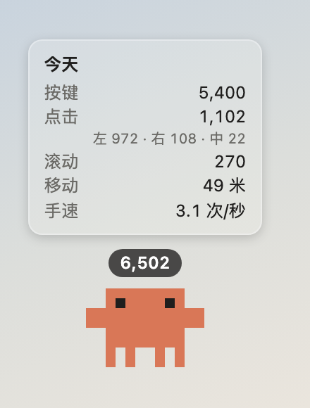

# Jokbet

[English](README.md) · **简体中文**

[](https://github.com/sparkjokerben/jokbet/actions/workflows/ci.yml)
[](LICENSE)
[](https://github.com/sparkjokerben/jokbet/releases/latest)

Jokbet 是一只统计键鼠操作的桌宠。它用 Claude Code 吉祥物的像素画风待在屏幕角落，跟着你打字和点击做出反应，并按天记录你做了多少——但不记录你打了什么。



支持 macOS 11+、Windows 和 Linux（X11）。界面中英双语，跟随系统语言。

## 功能

- 统计每个键按了几次、左中右键点击、滚动手势，以及鼠标移动距离（米），按天保存
- 头顶一个数字：今天的合计或每秒实时速度，可以选键盘、鼠标或两者合计
- 光标停在它身上看今天的数据；右键它或点托盘图标打开菜单
- 你打字时它掏出笔记本一起敲，点击时会缩一下，眼睛跟着光标转，你走开它就睡，也可以拖到屏幕任意位置
- 空闲时的动作和点击反应都能自己挑：踢球、东张西望、挥手、比心，或者只是呼吸
- 统计窗口：每日趋势、键盘热力图，还能导出 CSV
- 里程碑：当天第 1,000 次按键、累计第 100 万次，以及你自己设的任何阈值，它都会庆祝一下

## 安装

所有安装包都在[下载页](https://jokbet.jokerben.top/download)和 [Releases](https://github.com/sparkjokerben/jokbet/releases)。安装包没有经过 Apple 或微软的公证签名，第一次打开时系统会拦截，按下面的步骤放行。

### macOS

```sh
curl -fsSL https://jokbet.jokerben.top/install.sh | sh
```

这行命令会下载适合你这台 Mac 的最新版、核对公布的 SHA-256、装进 `/Applications` 并打开；再运行一次就是更新。建议先读一遍 [`site/install.sh`](site/install.sh)——脚本很短，那个地址给的就是它。

手动安装：解压 `.zip`，把 `Jokbet.app` 拖进「应用程序」（Apple 芯片选 `aarch64`，Intel 选 `x64`）。然后打开一次，系统提示无法验证开发者时，到**系统设置 → 隐私与安全性**点**仍要打开**（macOS 15 起右键「打开」已经不管用）。按提示授予**输入监控**权限（**系统设置 → 隐私与安全性 → 输入监控**），没有它桌宠会一脸问号，什么都统计不到。

浏览器下载的 `.dmg` 会被拦两次——打开磁盘映像时一次，里面的 app 再一次——所以 `.zip` 更省事。如果某次更新后不计数了，在「输入监控」里删掉旧条目再重新添加。

### Windows

运行 `.exe` 或 `.msi`。SmartScreen 提示「Windows 已保护你的电脑」时，点**更多信息 → 仍要运行**。部分杀毒软件会把监听键盘的程序当成可疑程序；本程序只做计数。

### Linux (X11)

用 AppImage（支持自动更新）或 `.deb`。只支持 X11 会话——Wayland 不允许程序监听全局输入。透明窗口需要合成器，托盘菜单需要支持 AppIndicator 的环境。

## 隐私

只保存计数，别的都不存：

- 每个键按了几次——不记录字符、词语，也不记录顺序
- 各鼠标键点了几次
- 滚动手势次数，以及鼠标移动了多远

没有遥测，没有账号，除了检查更新之外没有任何网络请求。数据全部写进本机的 SQLite 文件，离线也能正常使用。网站 `jokbet.jokerben.top` 用 Cloudflare Web Analytics 统计访问量，不用 Cookie，也不记录你是谁。

## 数据位置

计数存在 `stats.sqlite`，设置存在 `settings.json`。

| 平台 | 计数 | 设置 |
|---|---|---|
| macOS | `~/Library/Application Support/io.github.sparkjokerben.jokbet/` | 同一目录 |
| Windows | `%APPDATA%\io.github.sparkjokerben.jokbet\` | 同一目录 |
| Linux | `~/.local/share/io.github.sparkjokerben.jokbet/` | `~/.config/io.github.sparkjokerben.jokbet/` |

两个文件都删掉，Jokbet 就回到初次运行的状态。从项目旧名 `jokerben-desktop-pet` 升级上来的安装，会在首次启动时把这两个文件迁移过来。

## 已知限制

- **macOS**——开着「安全键盘输入」时（密码框里，或终端、iTerm 的这项设置），系统不让别的程序看到按键，这些按键不会计数；点击、鼠标移动和修饰键照常计数。
- **Windows**——管理员权限窗口里的输入看不到（除非 Jokbet 也以管理员运行）；它会留在启动时所在的那个虚拟桌面。
- **Linux**——只支持 X11。
- 它会待在别的窗口上面，包括全屏应用；挡到内容时可以从托盘菜单隐藏。

## 开发

需要 Node 24+ 和 stable 版 Rust 工具链。

```sh
npm install
npm run tauri dev        # 运行应用
npm test                 # 前端测试
npm run check            # 类型检查
cd src-tauri && cargo test
```

其他常用命令：

```sh
npm run sprites          # 把所有动画帧渲染到 sprites.png
node scripts/render-sprites.ts anim soccer out.png 8 4   # 单独渲染一个动画，放大
npm run icons            # 从精灵图重新生成应用和托盘图标
npm run site:check       # 网站生成物与源文件不一致时报错
```

开着 `npm run dev` 时，`http://localhost:1420/preview.html?view=stats`（还有 `settings`、`onboarding`、`pet`）会在普通浏览器里用假数据渲染一个窗口，方便不启动 Tauri 外壳做布局。`tauri dev` 的热重载用的也是这个服务。

在 macOS 上，`tauri dev` 把应用作为终端的子进程运行，所以「输入监控」权限要授予终端本身。想验证真实的权限流程，用 `npm run tauri build -- --debug --bundles app` 打出 app 包；每次重新构建都会换掉临时签名，所以要清掉旧授权：

```sh
tccutil reset ListenEvent io.github.sparkjokerben.jokbet
```

[`CONTRIBUTING.md`](CONTRIBUTING.md) 里有项目结构、必须跟着源文件重新生成的产物，以及一个 PR 该有的样子。[`site/`](site/README.md) 里的网站是四个静态页面，由 Cloudflare Worker 提供，同时也镜像每个发布文件；那些页面上的桌宠跑的是应用自己的动画代码，为浏览器打包而成。

## 发布

1. 改 `package.json` 和 `src-tauri/Cargo.toml` 里的版本号，提交，然后打 tag 并推送：

   ```sh
   git tag v0.1.2 && git push origin v0.1.2
   ```

2. CI 会把 macOS（Apple 芯片和 Intel）、Windows、Linux 都构建成一个**草稿** release。
3. 检查草稿，然后发布它。这会触发 *Publish to R2* 工作流，把该版本的全部文件和三个清单镜像到网站。
4. 运行 `npm run site:fallback` 并提交结果，让 Worker 自己那份清单也指向新版本。

已安装的副本会在六小时内发现更新，并在重启时安装。检查更新先问本站镜像、再问 GitHub；一边下载失败会自动换另一边重试。签名随清单一起走，所以两边下到的文件都能验证。更新签名私钥存在仓库的 `TAURI_SIGNING_PRIVATE_KEY` 和 `TAURI_SIGNING_PRIVATE_KEY_PASSWORD` secret 里——务必备份，没有它已安装的副本就再也无法更新。

## 贡献

欢迎提 issue 和 PR，动手前请先读 [`CONTRIBUTING.md`](CONTRIBUTING.md)。超出修 bug 范围的改动，请先开 issue 把思路谈拢，再写代码。

## 安全

漏洞的私下上报方式见 [`SECURITY.md`](SECURITY.md)。

## 许可

[MIT](LICENSE)。随便用、随便改、随便发布、随便卖。

许可覆盖的是代码，不覆盖桌宠形象及它所参考的素材——见 [`NOTICE`](NOTICE)。

Jokbet 是非官方同人作品，与 Anthropic 无关，也未获其认可或赞助。Claude、Claude Code 和 Clawd 是 Anthropic 的商标或角色。
